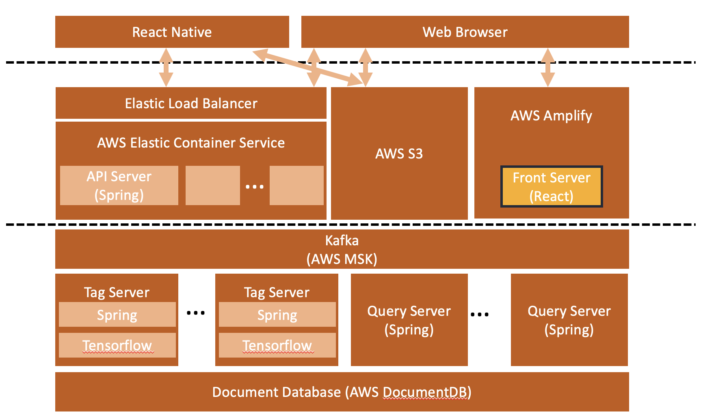
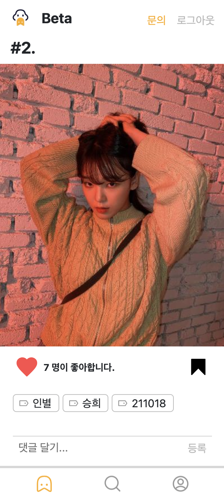
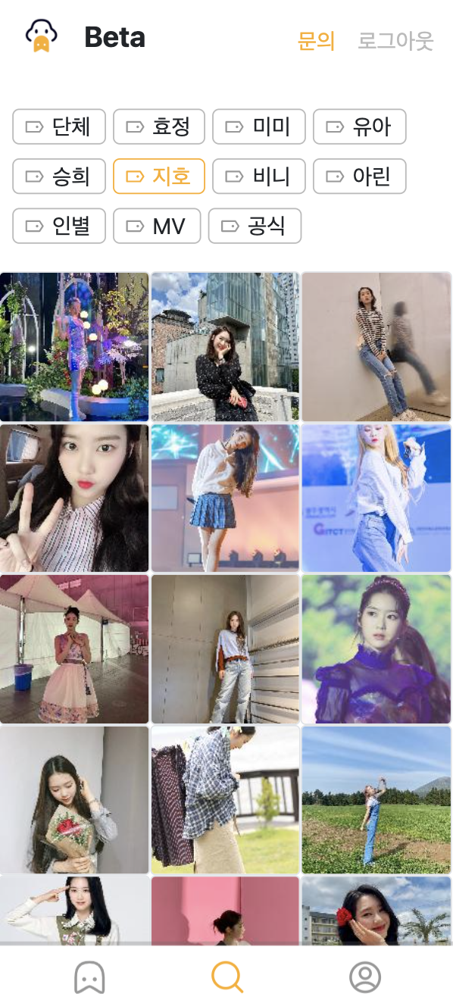

<p align="center">
    
    </img>
</p>
<h1 align="center">아이돌 덕질 플랫폼, <a href="https://udhd.pics">어덕행덕</a></h1>

<h3 align="center">어차피 덕질할 거 행복하게 덕질하자</h3>

<h4 align="center">
    <a href="#공통-부분">공통 부분</a> &nbsp; • &nbsp;
    <a href="#key-features">Key Features</a> &nbsp; • &nbsp;
    <a href="#screenshots">Screenshots</a> &nbsp; • &nbsp;
    <a href="#what-we-use">What We Use</a> &nbsp; • &nbsp;
    <a href="#how-to-use">How To Use</a> &nbsp; •&nbsp;  
    <a href="#made-by">Made By</a>

</h4>
<br>

## 공통 부분
### Problem

- 많은 사람들은 아이돌 짤방을 검색하고 저장하는데 문제를 겪고 있습니다.
- 대부분은 검색 결과에서 나타나는 중복 사진들에 대한 불편함과 일반적인 폴더 구조를 사용함으로서 생기는 관리의 어려움입니다.
- 또한 찾고싶은 사진이 있는데 키워드를 몰라 검색하지 못하기도 합니다.

### Solution

- 특정 알고리즘과 자료구조를 사용해 내가 가지고 있는 사진을 걸러내고 나에게 없는 사진만 보여줍니다.  
- 각 사진에 적합한 태그(해시태그)를 사용해 사진을 손쉽게 관리할 수 있습니다.  
- 특정 사진과 유사한 사진도 함께 찾아볼 수 있습니다.
<br/><br/>

[Front Server](https://git.swmgit.org/swm-12/12_swm44/udhd-front)
- [API Server](https://git.swmgit.org/swm-12/12_swm44/api-server)
- [Query Server](https://git.swmgit.org/swm-12/12_swm44/udhd-query-api)
- [Tag Server](https://git.swmgit.org/swm-12/12_swm44/img-experiment-lab)

---
<br/>

## Key Features

- 매주 인기있는 사진을 볼 수 있습니다.
- 태그별 사진을 검색할 수 있습니다.
- 유사한 사진을 검색할 수 있습니다.
- 나에게 없는 사진만을 볼 수 있습니다.

---
<br/>

## Screenshots
### Weekly 인기 사진


### 태그 검색


### 유사한 이미지 검색


### 마이페이지

<br/>

---

<br/>

<br>


## What We Use
<table style="margin-left:auto;margin-right:auto;">
<tr>
<td></td>
<td></td>
</tr>
<tr>
<td colspan="2">

</td>
</tr>
<table>


## How To Use
```
npm i
npm run build
```

## Made By

Team - Kim Dong Uk / SW Maestro 12st

